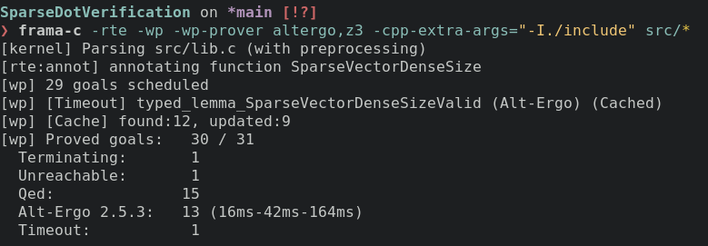

# SparseDotVerification

Проект должен был содержать код для скалярного произведения разреженных
векторов на C и его формальное подтверждение. Однако у меня удалось
реализовать и формально подтвердить только функцию, которая выводит
минимальную размерность разреженного вектора (то есть максимум массива
индексов его элементов).

В один момент мне потребовалось использовать индукцию в доказательстве,
однако автоматические доказатели теорем (в частности Alt-Ergo и Z3) не 
сильны в таком. У меня получилось доказать это свойство в Coq (язык для
машинного подтверждения доказательств, например, для подтверждения
доказательства теоремы о четырёх красках), однако из документации Frama-C
мне не понятно, как использовать это доказательство в Frama-C.

`typed_lemma_SparseVectorDenseSizeValid` это и есть одно недоказанное
свойство. Автоматически же были доказаны 30/31 свойств. Доказательство
на Coq можно увидеть в 
`.frama-c/wp/interactive/lemma_SparseVectorDenseSizeValid.v`.

Frama-C, ACSL и Coq были изучены. Также был написан небольшой
`Makefile` с командой `make check` для проверки формальных свойств.
